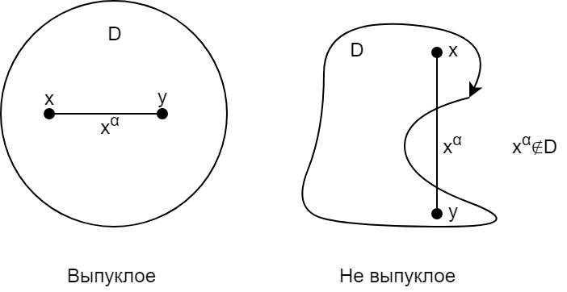
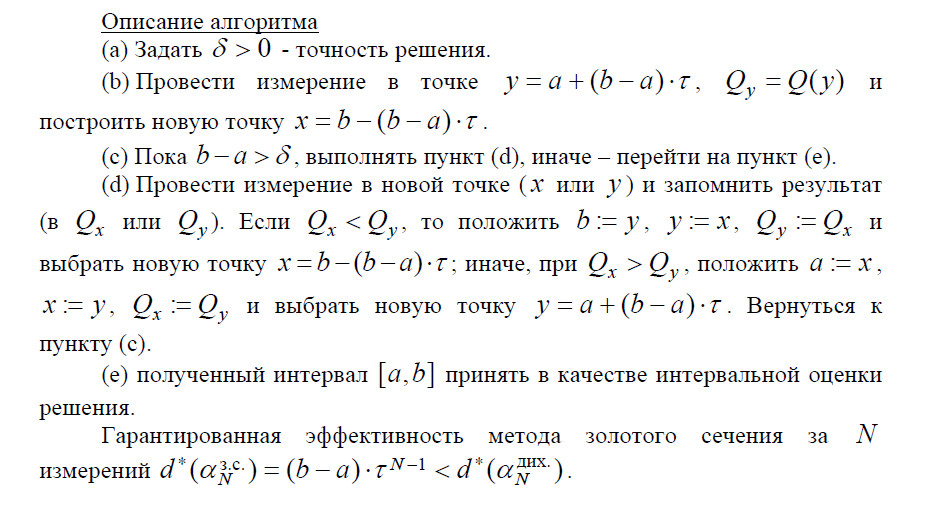
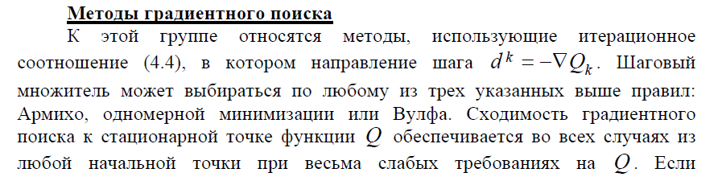

# 1. Постановка задачи динамического программирования (можно на примере).

## Общая постановка задачи динамического программирования

Найти такое начальное состояние \in&space;X^{s}>) и такой допустимый набор управлений , переводящий систему в одно из состояний \in&space;X^{f}>), чтобы общие затраты, являющиеся аддитивной функцией затрат, были минимальны (или максимальны, если прибыль).

Пояснения к постановке задачи:

-   >) - **управление** в момент времени 
-   >) - **состояние** в момент времени 

**Динамическая система (ДС)** - объект, для которого можно однозначно определить ,&space;\forall&space;\bar{t}&space;>&space;t) при известном управлении ,&space;\tilde{\iota&space;}&space;\in&space;\left&space;[&space;t,&space;\bar{t}&space;\right&space;]>), и зная описание x(t) данного объекта.

ДС определяется набором , где:

-   X - множество состояний
    -    - множество начальных состояний
    -    - множество конечных состояний
-   T - множество допустимых моментов времени
-   F - множество операторов или оператор, позволяющий по x(t) определить x()
-   U - множество значений управлений, зависящих от момента времени и текущего состояния

**Оператор ДС/определение ДС** - >)

>) - функция доходов/затрат на текущем шаге

**Требования к ДС:**

-   новые состояния и функции затрат/доходов зависят только от предыдущего состояния, управления и момента времени
-   управление зависит от предыдущего состояния и момента времени

# 2. Общий вид рекуррентных уравнений Беллмана

### Обозначения:

-    - управление
-    - состояние
-    - оператор динамической системы, позволяет по x(t) определить x(t1) для любого допустимого
    момента времени t1 > t
-    множество состояний, из которых (при использовании допустимых управлений) можно ровно за k шагов попасть в одно из состояний финального множества 
-   U - множество возможных значений управлений, зависящее от текущего момента времени и текущего состояния

Для решения задач динамического программирования используется подход, разработанный в лаборатории Р. Беллмана в 50-х годах XX века

Обозначим через >) **функцию, описывающую зависимость оптимальных затрат от состояния**  за k последних шагов, переводящих систему из состояния  в . Такие функции называют **функциями Беллмана**.

Функция оптимальных затрат >) может быть записана следующим образом:

-    (1.1)
Условия:
-   >) ;
-   \epsilon&space;x_{N}>)

Второе ограничение необходимо для того, чтобы гарантировать достижение заданного финального множества 

Можно доказать, что функция оптимальных затрат >) каждой следующей задачи рекуррентно выражается через предыдущую

-   >) , а именно, для  :
     (1.2)
Условия:
-   >) ;
-   \epsilon&space;Y_{k}>)

где в ограничениях последнее условие обеспечивает попадание точки  в
область определения функции .

Пусть >) – значение управления, при котором достигается минимум затрат в (1.2). Выражения (1) >) определяют для каждого момента времени оптимальные правила управления в виде функций от текущего состояния динамического процесса, т.е. задают закон оптимального управления в форме оптимального регулятора по состоянию.

Оптимальное начальное состояние  можно получить из решения
следующей задачи:
 (1.3)

Систему (1.1)-(1.3) называют **рекуррентными уравнениями Беллмана**.
Значения оптимального управления в явном виде можно последовательно определить следующим образом: ,&space;x_{1}^{*}=f_{1}(x_{0}^{*},u_{1}^{*}),..,u_{1}^{*}=u_{k}^{*}(x_{k-1}),&space;x_{k}^{*}=f_{k}(x_{k-1}^{*},u_{k}^{*})>),
и так далее, включая  и  .

Заметим, что уравнения (1.1), (1.2) определяют следующее правило построения управления: вне зависимости от того, каким образом управляемый процесс на шаге k попал в состояние  , далее надо применять управление, оптимальное для этого состояния в завершающем (N − k)-шаговом процессе с учетом оптимального продолжения, и в состоянии  нужно применять правило >) , определяющее первый «такт» такого управления.

# 3. Выпуклое множество – определение, примеры.

Отрезком [x, y] в  называется геометрическое место точек {*y,&space;\alpha&space;\in&space;[0,1]}>)}

Элемент отрезка может быть записан как: >)

**Выпуклое множество** в _аффинном_ или _векторном_ пространстве — множество, в котором все точки отрезка, образуемого любыми двумя точками данного множества, также принадлежат данному множеству.

Непустое множество  называется **выпуклым множеством**, если
для любых элементов _x_ и _y_ из _D_ соединяющий их отрезок , т.е.
 и 

*y\in&space;D>)

Пустое множество считается выпуклым по определению.
Операция пересечения, примененная к совокупности (конечной или бесконечной) выпуклых множеств не нарушает выпуклости, а операция объединения может ее нарушить.
Операции сложения, вычитания, домножения на числа не нарушают
выпуклости.

**Примеры**

Пусть  выпуклое множество, 
Доказать, что  выпукло

 - выпуклые;  - выпуклое?

Пусть x и y принадлежат этому пересечению }>)
Доказать, что *y\in\widetilde{G}>)

**Доказательство:**

 - выпуклое

 - выпуклое

*y\in&space;G_{1}>) (т.к. G1 - выпуклое)

*y\in&space;G_{2}>) (т.к. G2 - выпуклое)

 выпуклое

# 4. Выпуклая функция – определение, пояснение с помощью рисунка.

### Определения

-   **Функцию** Q , определенную на выпуклом множестве D , называют **выпуклой** на D , если epiQ (D ) - выпуклое множество.
    -   Пусть на множестве  задана функция Q. Множество  называют ее **надграфиком** (**эпиграфом**), если
        
-   **Функция** Q , определенная на выпуклом множестве , называется **выпуклой** (**выпуклой вниз**) на D , если 
  
    
-   Если при тех же условиях вместо неравенства вида «≤» выполняется неравенство вида «≥», то **функция** называется **вогнутой (выпуклой вверх)**. Если 
    
     функция называется **строго выпуклой (строго вогнутой)**.
-   Согласно последних определений **выпуклость функции** Q на D
    **геометрически** означает, что для всякого отрезка [x, y], включенного в D, график этого отрезка () проходит нестрого ниже соответствующей хорды, опирающейся на значения Q (x) и Q (y) (рис. 2.1).

-   Если **функция** Q является **аффинной**, т.е. Q (x) = a ⋅ x + b , то она **одновременно и выпукла и вогнута**.

### Критерий выпуклости дифференцируемой функции Q (x)

На открытом выпуклом множестве D функция Q (x) выпукла тогда и только тогда, когда 

Неравенство означает, что график (поверхность) функции всюду проходит нестрого выше ее линейного приближения (касательной гиперплоскости), построенного по измерениям функции Q и ее градиента ∇Q в произвольной точке y из D.

# 1. Постановка задачи динамического программирования (можно на примере).

## Общая постановка задачи динамического программирования

Найти такое начальное состояние \in&space;X^{s}>) и такой допустимый набор управлений , переводящий систему в одно из состояний \in&space;X^{f}>), чтобы общие затраты, являющиеся аддитивной функцией затрат, были минимальны (или максимальны, если прибыль).

Пояснения к постановке задачи:

-   >) - **управление** в момент времени 
-   >) - **состояние** в момент времени 

**Динамическая система (ДС)** - объект, для которого можно однозначно определить ,&space;\forall&space;\bar{t}&space;>&space;t) при известном управлении ,&space;\tilde{\iota&space;}&space;\in&space;\left&space;[&space;t,&space;\bar{t}&space;\right&space;]>), и зная описание x(t) данного объекта.

ДС определяется набором , где:

-   X - множество состояний
    -    - множество начальных состояний
    -    - множество конечных состояний
-   T - множество допустимых моментов времени
-   F - множество операторов или оператор, позволяющий по x(t) определить x()
-   U - множество значений управлений, зависящих от момента времени и текущего состояния

**Оператор ДС/определение ДС** - >)

>) - функция доходов/затрат на текущем шаге

**Требования к ДС:**

-   новые состояния и функции затрат/доходов зависят только от предыдущего состояния, управления и момента времени
-   управление зависит от предыдущего состояния и момента времени

# 6.	Критерий выпуклости для дважды непрерывно дифференцируемой функции.

### Сначала разберемся в некоторых в понятиях:
- **Матрица Гессе**: 
Матрицей Гессе функции m переменных ) называется матрица, составленная из вторых ) по всем переменным
- **Гессиан функции**: 
симметрическая квадратичная форма, описывающая поведение функции во втором порядке.
Для функции f, дважды дифференцируемой в точке 
=\sum_{i=1}^{n}\sum_{j=1}^{n}a_{ij}x_{i}x_{j}),
описывающую наилучшее квадратичное приближение функции в некоторой окрестности точки x и имеющую матрицу вида:
 
так называемую матрицу Гессе, определитель которой обычно подразумевается под **Гессианом**
Про квадратичную форму можно почитать [здесь](https://studfiles.net/preview/6144690/page:5/)

-  - скорее всего подразумевается вектор 
-  - транспонированный вектор 
- Непрерывная функция - функция y=f(x) называется непрерывной в точке , если =f(x_{0}))
- Симеетричная матрица  
- дважды непрерывно дифференцируемые функции — функции имеющие непрерывную вторую производную.

### Теперь попробуем разобраться в билете
Пусть Q определена на открытом выпуклом множестве D. Q выпукла на D тогда и только тогда, когда матрица Гессе (обозначим ее )) неотрицательно определена на D, т.е. ∀x∈D и произвольного d d\geq0). Заметим, что в силу непрерывности вторых частных производных матрица Гессе будет симметрической.

**Комментарий**: Напомним, что характер знакоопределенности симметрической матрицы   определяется по знаку квадратичной формы   для  . Если знак может быть различен для разных d , то матрицу A называют знаконеопределенной.

В интернете существует еще одно определение для частного случая. Для того чтобы функция f, дважды дифференцируемая в интервале (a,b), была выпуклой вниз (вверх) на (a,b), необходимо и достаточно, чтобы \geq&space;0) (\leq&space;0) ) во всех точках ).

# 7. Связь знакоопределенности симметрической матрицы со знаками собственных чисел.

Пусть A - симметрическая матрица. A называется неотрицательно определенной (A>=0), если для любого d
, где d - вектор

Положительно определена 

Знаконеопределена, если существует вектор d', что
^{T}Ad'>&space;0) и ^{T}Ad''<&space;0)

Положительная определенность матрицы связана с положительностью ее главных миноров

Матрица положительно определена, если 

Матрица отрицательно определена, если знаки главных миноров чередуются.

Если хотя бы 1 минор обратился в 0, то критерий не применим(Критерий Сильвестра)

Напомним, что характер знакоопределенности симметрической матрицы  определяется по знаку квадратичной формы  для d ≠ 0. Если знак может быть различен для разных d , то матрицу A называют знаконеопределенной.

Известно, что собственные числа  симметрической матрицы всегда действительны, а представление соответствующей ей квадратичной формы в каноническом виде приводит к выражению . Таким образом, знаки набора собственных чисел  полностью определяют характер знакоопределенности матрицы, например при >) матрица A будет неотрицательно определена.

# 8. Градиент. Производная по направлению.

## Из методички

## Вектор градиента и касательная гиперплоскость
Будем обозначать вектор градиента следующим образом

Рассмотрим геометрическое место точек x, для которых Q(x) = C. В общем случае (а именно, при выполнении условия, когда \neq&space;0) во всех точках указанного множества), это будет поверхность, которую называют **поверхностью (гиперповерхностью) равного уровня**. Пусть она проходит через точку  . Тогда ) и на поверхности равного уровня выполняется равенство
=Q(x^{0}))

Если функция Q(x) дифференцируема в точке  , то
=Q(x^{0})&plus;\sum_{i=1}^{n}\frac{\partial&space;Q(x^{0})}{\partial&space;x_{i}}(x_{i}-x_{i}^{0})&plus;o(||x-x^{0}||))

При этом с использованием векторной формы записи:

Подставляя эти выражения в (3.3) и сокращая на Q(), получим следующее представление поверхности равного уровня:

Отбрасывая последний нелинейный член суммы, будем иметь **линейную аппроксимацию поверхности** в окрестности :

Мы получили **уравнение касательной** в точке  гиперплоскости. Очевидно, вектор ∇Q() ортогонален к ней. Следовательно, вектор градиента локально ортогонален также поверхности равного уровня функции в точке .

## Производная по направлению, множество направлений строгого локального убывания

Пусть v – вектор направления. Считаем его нормированным ().
По определению

####Замечание.
Производная по направлению может существовать и при отсутствии дифференцируемости Q в точке . В качестве примера можно указать на недифференцируемую в x = 0 функцию скалярного аргумента Q(x) = |x|, у которой производные по двум направлениям v = ±1 в точке 0 существуют и обе равны 1.

Получим **выражение для производной по направлению** в случае дифференцируемости функции в точке , используя представление (3.4).

#### Замечание.
Множество направлений строгого локального убывания функции, дифференцируемой в точке , есть открытое полупространство вида:

с границей, ортогональной ∇Q()

## Из лекций

**Градиент** - направление наибольшего возрастания функции

 -  направлен противоположно градиенту

 - **антиградиент**

# 9. Теорема Ферма.

,x&space;\in&space;R^{n})

**Необходимое условие:**
-   Нахождение условия экстремума первого порядка при отсутствии ограничений

**Формулировка:**

Если  - локальный min функции Q в , Q дифференцируема в , то градиент =0)

**Доказательство:**

Пусть \neq0)

}{|\bigtriangledown&space;Q(x^{0})|})

Получено противоречие, значит предположение неверно.

# 10.	Функция Лагранжа для общей задачи математического программирования.

### Для начала разберем понятие математического программирования:
- **Оптимизация**: 
  - в математике, информатике и исследовании операций задача нахождения экстремума (минимума или максимума) целевой функции в некоторой области конечномерного векторного пространства, ограниченной набором линейных и/или нелинейных равенств и/или неравенств.
  - Теорию и методы решения задачи оптимизации изучает математическое программирование.
- **Математическое программирование** — это область математики, разрабатывающая теорию, численные методы решения многомерных задач с ограничениями. 
- **Постановка задачи оптимизации**
  В процессе проектирования ставится обычно задача определения наилучших, в некотором смысле, структуры или значений параметров объектов. Такая задача называется оптимизационной.
- Стандартная математическая задача оптимизации формулируется таким образом. Среди элементов χ, образующих множества Χ, найти такой элемент χ*, который доставляет минимальное значение f(χ*) заданной функции f(χ). 
Для того, чтобы корректно поставить задачу оптимизации, необходимо задать:
  - Допустимое множество ;
  - Целевую функцию — отображение 
  - Критерий поиска (max или min)
- [Подробно здесь](https://ru.wikipedia.org/wiki/%D0%9E%D0%BF%D1%82%D0%B8%D0%BC%D0%B8%D0%B7%D0%B0%D1%86%D0%B8%D1%8F_(%D0%BC%D0%B0%D1%82%D0%B5%D0%BC%D0%B0%D1%82%D0%B8%D0%BA%D0%B0)#%D0%9F%D0%BE%D1%81%D1%82%D0%B0%D0%BD%D0%BE%D0%B2%D0%BA%D0%B0_%D0%B7%D0%B0%D0%B4%D0%B0%D1%87%D0%B8_%D0%BE%D0%BF%D1%82%D0%B8%D0%BC%D0%B8%D0%B7%D0%B0%D1%86%D0%B8%D0%B8)
- **Комментарий**: Задачи оптимизации, в которых целевая функция f(x) и функции-ограничения являются линейными функциями, разрешаются так называемыми методами линейного программирования.
В противном случае имеют дело с задачей нелинейного программирования и применяют соответствующие методы.(вот это и есть МНО, господа)

### Задача математического программирования по записям в тетради:
min Q(x)

Существует минимум двух типов:
- x* - точка глобального минимума, если \leq&space;Q(x))
- x* - точка локального минимума, если существует окрестность U(x*): выполняется \bigcap&space;D,&space;Q(x^{*})\leq&space;Q(x))

### Функция Лагранджа

=\lambda&space;_{0}Q(x)&plus;\sum_{i=1}^{n}\lambda&space;_{i}g_{i}(x)&plus;\sum_{j=1}^{M}\mu&space;_{j}h_{j}(x))
 - СКОРЕЕ ВСЕГО это коэффициенты Лагранджа
 - Так можно записать условие разложимости (одно из условий того, что x* является минимумом рассматриваемой функции)

#### Метод множителей Лагранжа
применяемый для решения задач математического программирования (в частности, линейного программирования) — метод нахождения условного экстремума функции f(x), где , относительно m ограничений =0), где  i меняется от единицы до m.
- [Метод Лагранджа (без ограничений-неравенств)](https://ru.wikipedia.org/wiki/%D0%9C%D0%B5%D1%82%D0%BE%D0%B4_%D0%BC%D0%BD%D0%BE%D0%B6%D0%B8%D1%82%D0%B5%D0%BB%D0%B5%D0%B9_%D0%9B%D0%B0%D0%B3%D1%80%D0%B0%D0%BD%D0%B6%D0%B0)
- это условие(метод Лагранджа) носит необходимый, но не достаточный характер.

# 11. Теорема Лагранжа – условие оптимальности для задач с равенствами.

**Функция Лагранжа**:

Для того, чтобы точка x* была локальным минимумом рассматриваемой задачи, необходимо выполнение группы условий:
- требование нетривиальности : \neq&space;0)

Если ввести функцию Лагранжа, записав ее с использованием векторных обозначений:

условие разложимости можно представить как условие стационарности
функции Лагранжа: >)=0)

Чтобы  была локальным экстремумом функции Q(x) с ограничениями =0,i=\overline{1,p}>) , необходимо выполнение условий стационарности ф.Лагранжа по всем ее переменным , 

# 12. Теорема Каруша – Куна – Таккера.

Для того, чтобы точка  была локальным минимумом рассматриваемой задачи, необходимо выполнение группы условий:

a)  - **допустимость**

b) \neq0>) - **нетривиальность**

c)  - **неотрицательность**

d) =\sum_{i=1}^{N}\lambda_{i}^{*}\bigtriangledown&space;g_{i}(x^{*})+\sum_{j=1}^{M}\mu_{j}^{*}\bigtriangledown&space;h(x^{*})>) - **разложимость**

e) =0,(i\in1,...,N)>) - **условие дополняющей нежесткости**

Ограничения-неравенства, обращающиеся в ноль в точке x*, называют активными в этой точке. Для множества номеров активных в точке x* неравенств удобно ввести специальное обозначение – I (x*) .

Укажем на содержательный смысл условий дополняющей нежесткости. Из (е) следует, что для неактивных в точке x* неравенств  . Следовательно, неактивные ограничения не входят в условие разложимости (d) и не влияют на выполнение условий оптимальности. Фактически, в (d) суммирование выполняется только по номерам ) .

Если неравенство активное, то =0) , то <0) , тогда .

Заметим, что для задач без ограничений-равенств аналогичную теорему обычно называют теоремой **_Куна-Таккера_** (при этом все, что связано с равенствами, из условий теоремы следует исключить), а для задач без ограничений-неравенств – теоремой **_Лагранжа_**.

# 13. Активные ограничения. Условия дополняющей нежесткости.

=0,&space;j\in\left&space;[1,N&space;\right]>) - **условие дополняющей нежесткости**

-    - точка локального минимума
-    - константа
-    - ограничение

**Активное ограничение** - ограничение неравенства, обращающееся в 0 в точке 

>) - множество номеров, активных в точке  неравенств

Неактивные неравенства не входят в условие разложимости.

-   Если неравенство активно, то =0>).
-   Если неравенство неактивно, <0>), тогда  (из условия дополняющей нежесткости)

# 14.	Геометрический смысл условий К.-К.-Т при числе переменных n = 2 

### Напомним основные понятия:
- **Антиградиент функции**:  
 — вектор, компоненты которого совпадают по абсолютной величине с компонентами градиента функции, но имеют противоположный знак. Показывает направление наискорейшего убывания функции.
- **Линейная независимость системы векторов**:
 — Если линейная комбинация }&plus;\lambda_{2}\alpha^{(2)}&plus;..&plus;\lambda_{p}\alpha^{(p)}) представляет собой нулевой вектор только тогда, когда все числа  равны нулю, то система векторов },\alpha^{(2)},..,\alpha^{(p)}) называется линейно независимой.
- **Условие регулярности Слейтера**:
Оно применимо только при следующих условиях:
,..,g_{N}(x)) выпуклы (вниз), ,..,h_{M}(x)) либо отсутствуют,
либо аффинны.
Если при этих условиях в множестве D существует
допустимая точка x , все неравенства в которой выполняются строго, т.е. <&space;0(i=1,..,N)) , то область D регулярна во всех своих точках.
Для невыпуклого гладкого случая можно использовать достаточное условие регулярности в форме независимости градиентов: если в точке  активны (т.е. обращаются в равенства) ограничения =0,..,g_{ir}(x^{*})=0) и система векторов ,..,\bigtriangledown&space;g_{ir}(x^{*}),\bigtriangledown&space;h_{1}(x^{*}),..,\bigtriangledown&space;h_{M}(x^{*})) линейно независима, то область D регулярна в точке .

### Геометрический смысл условий К.-К.-Т при числе переменных n = 2
Предположим, что в точке  активны только два ограничения с номерами 1 и 2.

Вектора градиентов ,\bigtriangledown&space;g_{2}(x^{*}))для этих ограничений являются внешними нормалями к соответствующим фрагментам границы допустимого множества. В общем случае, если фрагменты границ пересекаются без касания, система этих векторов линейно независима, следовательно, допустимое множество будет регулярно в точке  и в системе условий Куна-Таккера можно принять . Из условий теоремы ККТ следует, что если  – локальный минимум, то =\lambda^{*}_{1}\cdot&space;\bigtriangledown&space;g_{1}(x^{*})&plus;&space;\lambda^{*}_{2}\cdot&space;\bigtriangledown&space;g_{2}(x^{*})) при .

Геометрически это означает, что вектор антиградиента целевой функции в точке x* содержится в замкнутом конусе A(x*) , натянутом на внешние нормали к границам активных неравенств (рис. 3.1 (а)):

В случае дифференцируемости функции ∂Q(x*) ∂v = (∇Q(x*), v).
Поэтому направления ее строгого локального убывания образуют открытый конус B(x*) , показанный на рис. 3.1 (b) где
.

Для локальной оптимальности  требуется локальная (в окрестности точки ) непересекаемость допустимого множества D с конусом B() направлений строгого локального убывания (после перемещения его вершины в точку ). Чтобы это требование было выполнено, необходимо и достаточно, чтобы внутренняя нормаль к границе конуса B() (такой нормалью является вектор антиградиента функции) не покидала конуса A() , а это означает возможность разложения (3.4) с неотрицательными коэффициентами.

На рис. 3.2 показан пример ситуации, когда в окрестности точки возникло пересечение D с B(). При этом в разложении (3.4) окажется .

Появление отрицательного значения у множителя Лагранжа свидетельствует о возможности строгого уменьшения значения Q() за счет ухода с фрагмента границы =0) множества D (при этом точка, естественно, не должна покидать допустимое множество).

# 15. Выпуклая задача математического программирования. Условия К.-К.-Т для выпуклой задачи.

Если функции  выпуклы (вниз), ограничения – равенства либо отсутствуют, либо аффинны, функция Q(x) выпукла (вниз), то такая задача называется выпуклой. В выпуклой задаче математического программирования все локальные минимумы являются глобальными.

Если задача математического программирования выпукла и при этом допустимая область D регулярна в точке x* (регулярность области в точке – это свойство, гарантирующее, что условия оптимальности всегда выполняются в этой точке при ), то условия теоремы Каруша-Куна-Таккера (а)-(e)

a)  - **допустимость**

b) \neq0>) - **нетривиальность**

c)  - **неотрицательность**

d) =\sum_{i=1}^{N}\lambda_{i}^{*}\bigtriangledown&space;g_{i}(x^{*})+\sum_{j=1}^{M}\mu_{j}^{*}\bigtriangledown&space;h(x^{*})>) - **разложимость**

e) =0,(i\in1,...,N)>) - **условие дополняющей нежесткости**

будут не только необходимыми, но и достаточными условиями, определяющими точку глобального минимума x\*.

# 16. Регулярность допустимой области. Достаточные условия регулярности.

**Регулярность области в точке** – это свойство, гарантирующее, что условия оптимальности всегда выполняются в этой точке при 

Можно указать простые достаточные условия регулярности для двух классов задач.

1) _Условие регулярности Слейтера_. Оно применимо только при следующих условиях: g1(x),..., gN (x) выпуклы (вниз), h1(x),...,hM (x) либо отсутствуют, либо аффинны(линейны). Если при этих условиях в множестве D из  существует допустимая точка  , все неравенства в которой выполняются строго, т.е. <0&space;(i=1,...,N)) , то область D регулярна во всех своих точках. Из условия Слейтера можно получить следующее _удобное следствие_. Если область D задана аффинными ограничениями и D ≠ ∅, то D регулярна во всех своих точках.

2) Для невыпуклого гладкого случая можно использовать достаточное _условие регулярности в форме независимости градиентов_: если в точке x* активны (т.е. обращаются в равенства) ограничения =0,...,g_{ir}(x^{*})=0) и система векторов  линейно независима, то область D регулярна в точке x*.

Выполнение условий регулярности, обеспечивающее  , позволяет принять * (за счет замен множителей Лагранжа), а также не рассматривать альтернативный вариант записи основного градиентного соотношения (d) при  . Для невыпуклых задач даже при регулярности допустимого множества в точке x* условия (а)-(е) остаются лишь необходимыми условиями локального минимума, тогда как для выпуклых задач при наличии регулярности условия (а)-(е) становятся критерием глобального минимума.

a)  - **допустимость**

b) \neq0>) - **нетривиальность**

c)  - **неотрицательность**

d) =\sum_{i=1}^{N}\lambda_{i}^{*}\bigtriangledown&space;g_{i}(x^{*})+\sum_{j=1}^{M}\mu_{j}^{*}\bigtriangledown&space;h(x^{*})>) - **разложимость**

e) =0,(i\in1,...,N)>) - **условие дополняющей нежесткости**

# 17. Условия К.-К.-Т для невыпуклой задачи - разобрать на примере.

## Условия Каруша-Куна-Таккера

Если функции ,g_{2}(x),\dots,g_{N}(x)>) выпуклы (вниз), ограничения – равенства либо отсутствуют, либо аффинны, функция Q(x) выпукла (вниз), то такая **задача**
называется **выпуклой**. В противном случае **задача невыпукла**.

Для задач, **не обладающих выпуклостью**, необходимые условия наличия в  локального минимума дает следующая **теорема Каруша-Куна-Таккера**.

Для того, чтобы точка  была локальным минимумом рассматриваемой задачи, необходимо выполнение группы условий:

-    - допустимость
-   \neq0>) - нетривиальность
-    - неотрицательность
-   =\sum_{i=1}^{N}\lambda_{i}^{*}\bigtriangledown&space;g_{i}(x^{*})+\sum_{j=1}^{M}\mu_{j}^{*}\bigtriangledown&space;h(x^{*})>) - разложимость
-   =0,&space;j\in\left&space;[1,N&space;\right]>) - условие дополняющей нежесткости

## Пример невыпуклой задачи

Пусть **требуется найти глобальный минимум** в задаче:

Допустимая область D задана линейными ограничениями (равенствами и неравенствами) и является выпуклой. Более того, нетрудно подобрать такую допустимую точку, например, , что неравенства выполняются строго, следовательно, для области D выполнено достаточное условие регулярности Слейтера. Поскольку все ограничения в задаче аффинны, можно было для выяснения вопроса о регулярности воспользоваться не самим условием Слейтера, а следствием из него для областей такого вида. Тогда было бы достаточно установить только непустоту множества D . Это значит, что в условиях Каруша-Куна-Таккера всегда можно считать .

**Матрица Гессе** имеет вид:

Поскольку **главные миноры** матрицы вторых производных **обращаются в нули**, то по критерию Сильвестра **нельзя выяснить знакоопределенность матрицы**.

Запишем ее характеристический полином относительно переменной p : . Подсчитав собственные числа, видим, что . Следовательно, **матрица Гессе является знаконеопределенной**, а минимизируемая **функция не является выпуклой**.

Поскольку задача не является выпуклой, условия Каруша-Куна-Таккера не будут являться достаточными, а будут лишь необходимыми условиями локального минимума. Поскольку условия оптимальности в этой задаче лишь только необходимы, то сначала следует доказать существование минимума в этой задаче. Если решение существует, то далее придется отыскивать все точки, где эти условия выполняются, и затем, сравнивая значение функции в этих точках, определять глобальный минимум.

В рассматриваемой задаче для упрощения решения можно, используя связь , исключить  из ограничений.
Тогда задача примет вид:
\in&space;R^{2}:x_{3}-x_{1}\geqslant&space;1,x_{1}-x_{3}\leqslant&space;2}>)

Поскольку в пространстве переменных  матрица вторых производных минимизируемой функции новой задачи

имеет собственные числа ,то поверхность  является седловой (что, впрочем, непосредственно видно из ее формулы) и функция не имеет конечных безусловных минимумов. При этом либо минимума вообще нет, либо он достигается на границах области. Проанализируем вопрос о существовании минимума.

**Проведем исследование**. Область  неограниченна. Изучим поведение функции вдоль прямых >), параллельных границам области. Введем вектор >), направленный вдоль этих прямых. Функция Q (x) имеет по направлению ν положительную вторую производную, поскольку

Отсюда и из квадратичного вида функции Q (x ) следует **существование конечного минимума в задаче**, поскольку **на бесконечности функция будет возрастать равномерно по параметру c**.

Исследуем границу .Система условий Куна-Таккера примет вид:

Они выполняются при  (точка B на рис. 3.4). Значение функции равно − 1 , т.е. меньше, чем в первой найденной точке. Следовательно, **глобальный минимум** вспомогательной задачи **достигается в точке** , а для исходной задачи — **в точке** 

# 18. Метод дихотомии

**Методы дихотомии** используются для нахождения безусловного минимума унимодальных функций Q(x). Они являются одними из самых простых методов последовательного поиска. Название связано с тем, что каждые два испытания в два раза (или примерно в два раза) сокращают область поиска.

**Унимодальная функция** - функция называется унимодальной, если она имеет единственный локальный минимум (максимум) на всей допустимой области. Для унимодальной функции **локальный минимум (максимум) является также и глобальным**.

### Алгоритм

1. Задать δ > 0 - точность решения.
2. Положить /2>) и >).
3. Пока b − a > δ выполнять шаги 3.1 и 3.2:
   3.1. Вычислить: /2>), >); /2>), >)
   3.2. Если , положить b := y, c := x, ; иначе,
   если , то положить a := x, b := y; иначе положить
   a := x, c := y, .
4. Завершить выполнение метода с интервальной оценкой решения
   

К недостаткам метода относится его работоспособность только для одноэкстремальных функций R(x) (т.е. таких, которые содержат один экстремум того типа, который мы ищем в задаче), так как в других случаях при сравнении двух критериев в соседних точках невозможно правильно выбрать следующий интервал, где находится минимум (максимум).

# 19. Метод золотого сечения

Рассмотрим методы, которые для очередного сжатия интервала поиска используют только одно новое измерение (кроме начального этапа, требующего проведения сразу двух измерений). Исходя из симметрии задачи, первые два измерения в точках x2 и y2 целесообразно размещать симметрично относительно центра интервала, а на вновь образованных интервалах новое измерение проводить в точке, симметричной точке прежнего измерения, существующей внутри интервала (рис. 4.2).

Обозначим через  доли, составленные длинами соответствующих частей текущего интервала по отношению к его собственной длине. Из рис. 4.2 вытекает следующая их взаимосвязь:

Метод золотого сечения использует постоянную пропорцию деления /2\approx0,62), полученную как стационарное решение уравнения (4.3).

# 20. Метод Фибоначчи.

## Из методички

# 21. Метод касательных.
,&space;\[a,b\])
f^{'}(b)<0)

(x-x_{0})) - уравнение  касательной

Точка 

Точка 

Если , то отрезок [a,b] является оценкой решения.

Если , то:
- Если f'(c)<0), то 
- Если  f'(c)>0),то  

# 22. Метод Ньютона

Данный метод использует локальные квадратичные аппроксимации функций. набором линейных и/или нелинейных равенств и/или неравенств.

**Аппроксимацией (приближением) функции** f(x) называется нахождение такой функции (аппроксимирующей функции) g(x), которая была бы близка заданной.

Рассмотрим произвольную дважды непрерывно дифференцируемую функцию. Пусть в точке  для Q(x) измерено значение >), градиент >) и матрица вторых производных >)

Построим локальную квадратичную аппроксимацию целевой функции: =Q_{k}+(\bigtriangledown&space;Q_{k},x-x^{k})+(x-x^{k})^{T}\bigtriangledown&space;^{2}_{xx}Q_{k}(x-x^{k})/2>)

Условие, определяющее стационарную точку  полинома >), имеет вид: =\bigtriangledown&space;Q_{k}+\bigtriangledown&space;^{2}_{xx}Q_{k}(\bar{x}-x^{k})=0>)

Если принять точку  за точку очередного испытания , получим **метод Ньютона**:
-   
- где  определяется из решения линейной системы вида
-   

### Свойства
1. Для квадратичной функции Q(x) при невырожденности 
метод Ньютона из любой начальной точки  переходит за один шаг в –
стационарную точку функции Q(x), которая, в зависимости от характера знакоопределенности матрицы , может быть точкой минимума,
максимума, а также – седловой точкой.
    - Доказательство.
      Вытекает из по способа построения метода

Там еще 3 свойства, но я ебал их писать, ребят. Потому что это ебанина редкая и нам она их не объясняла.Это методичка Городецкого, страница 111, так идите туда, если нужно

# 23. Методы градиентного поиска.

Рассмотрим задачу :x\in&space;R^{n}\right}>). Большинство методов локальной оптимизации имеют вид итерационных процедур

, _k=0, 1, 2_ **(4.4)**

 - точки с номерами k, k+1

 - направление шага, вектор

 - велечина шага, шаговый множитель

=-\nabla&space;Q_{k}>) - градиентный поиск

 - **метод наискорейшего градиентного поиска**

,&space;t\geq&space;0>)

## Из методички

# 24. Метод наискорейшего градиентного спуска.

## Из конспекта:

