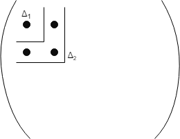

# 7. Связь знакоопределенности симметрической матрицы со знаками собственных чисел.

Пусть A - симметрическая матрица. A называется неотрицательно определенной (A>=0), если для любого d
, где d - вектор

Положительно определена 

Знаконеопределена, если существует вектор d', что
^{T}Ad'>&space;0) и ^{T}Ad''<&space;0)

Положительная определенность матрицы связана с положительностью ее главных миноров

Матрица положительно определена, если 

Матрица отрицательно определена, если знаки главных миноров чередуются.

Если хотя бы 1 минор обратился в 0, то критерий не применим(Критерий Сильвестра)

Напомним, что характер знакоопределенности симметрической матрицы  определяется по знаку квадратичной формы  для d ≠ 0. Если знак может быть различен для разных d , то матрицу A называют знаконеопределенной.

Известно, что собственные числа  симметрической матрицы всегда действительны, а представление соответствующей ей квадратичной формы в каноническом виде приводит к выражению . Таким образом, знаки набора собственных чисел  полностью определяют характер знакоопределенности матрицы, например при >) матрица A будет неотрицательно определена.
