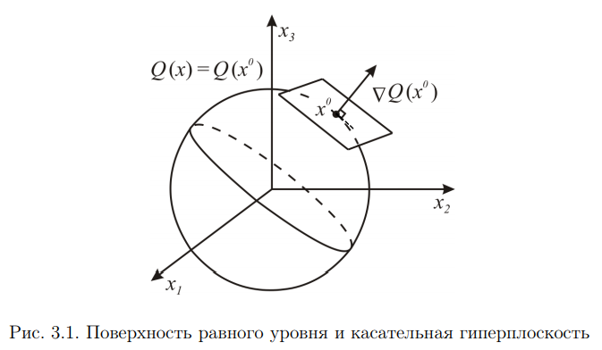

# 8. Градиент. Производная по направлению.

## Из методички

## Вектор градиента и касательная гиперплоскость
Будем обозначать вектор градиента следующим образом

Рассмотрим геометрическое место точек x, для которых Q(x) = C. В общем случае (а именно, при выполнении условия, когда \neq&space;0) во всех точках указанного множества), это будет поверхность, которую называют **поверхностью (гиперповерхностью) равного уровня**. Пусть она проходит через точку  . Тогда ) и на поверхности равного уровня выполняется равенство
=Q(x^{0}))

Если функция Q(x) дифференцируема в точке  , то
=Q(x^{0})&plus;\sum_{i=1}^{n}\frac{\partial&space;Q(x^{0})}{\partial&space;x_{i}}(x_{i}-x_{i}^{0})&plus;o(||x-x^{0}||))

При этом с использованием векторной формы записи:

Подставляя эти выражения в (3.3) и сокращая на Q(), получим следующее представление поверхности равного уровня:

Отбрасывая последний нелинейный член суммы, будем иметь **линейную аппроксимацию поверхности** в окрестности :

Мы получили **уравнение касательной** в точке  гиперплоскости. Очевидно, вектор ∇Q() ортогонален к ней. Следовательно, вектор градиента локально ортогонален также поверхности равного уровня функции в точке .

## Производная по направлению, множество направлений строгого локального убывания

Пусть v – вектор направления. Считаем его нормированным ().
По определению

####Замечание.
Производная по направлению может существовать и при отсутствии дифференцируемости Q в точке . В качестве примера можно указать на недифференцируемую в x = 0 функцию скалярного аргумента Q(x) = |x|, у которой производные по двум направлениям v = ±1 в точке 0 существуют и обе равны 1.

Получим **выражение для производной по направлению** в случае дифференцируемости функции в точке , используя представление (3.4).

#### Замечание.
Множество направлений строгого локального убывания функции, дифференцируемой в точке , есть открытое полупространство вида:

с границей, ортогональной ∇Q()

## Из лекций

**Градиент** - направление наибольшего возрастания функции

 -  направлен противоположно градиенту
 - **антиградиент**
