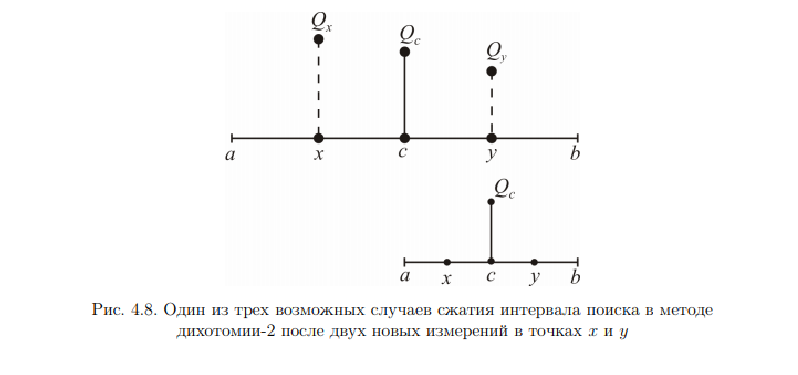

# 18. Метод дихотомии

**Методы дихотомии** используются для нахождения безусловного минимума унимодальных функций Q(x). Они являются одними из самых простых методов последовательного поиска. Название связано с тем, что каждые два испытания в два раза (или примерно в два раза) сокращают область поиска.

**Унимодальная функция** - функция называется унимодальной, если она имеет единственный локальный минимум (максимум) на всей допустимой области. Для унимодальной функции **локальный минимум (максимум) является также и глобальным**.

### Алгоритм

1. Задать δ > 0 - точность решения.
2. Положить /2>) и >).
3. Пока b − a > δ выполнять шаги 3.1 и 3.2:
   1. Вычислить: /2>), >); /2>), >)
   2. Если , положить b := y, c := x, ; иначе,
   если , то положить a := x, b := y; иначе положить
   a := x, c := y, .
4. Завершить выполнение метода с интервальной оценкой решения
   

К недостаткам метода относится его работоспособность только для одноэкстремальных функций R(x) (т.е. таких, которые содержат один экстремум того типа, который мы ищем в задаче), так как в других случаях при сравнении двух критериев в соседних точках невозможно правильно выбрать следующий интервал, где находится минимум (максимум).
