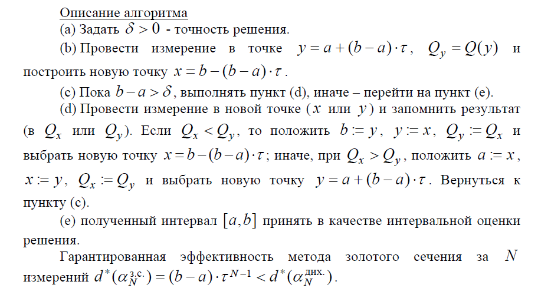

# 19. Метод золотого сечения

Рассмотрим методы, которые для очередного сжатия интервала поиска используют только одно новое измерение (кроме начального этапа, требующего проведения сразу двух измерений). Исходя из симметрии задачи, первые два измерения в точках x2 и y2 целесообразно размещать симметрично относительно центра интервала, а на вновь образованных интервалах новое измерение проводить в точке, симметричной точке прежнего измерения, существующей внутри интервала (рис. 4.2).

Обозначим через  доли, составленные длинами соответствующих частей текущего интервала по отношению к его собственной длине. Из рис. 4.2 вытекает следующая их взаимосвязь:

Метод золотого сечения использует постоянную пропорцию деления /2\approx0,62), полученную как стационарное решение уравнения (4.3).

