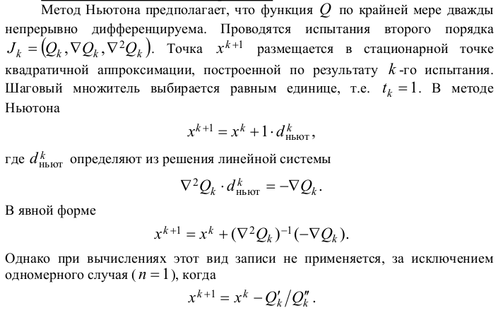
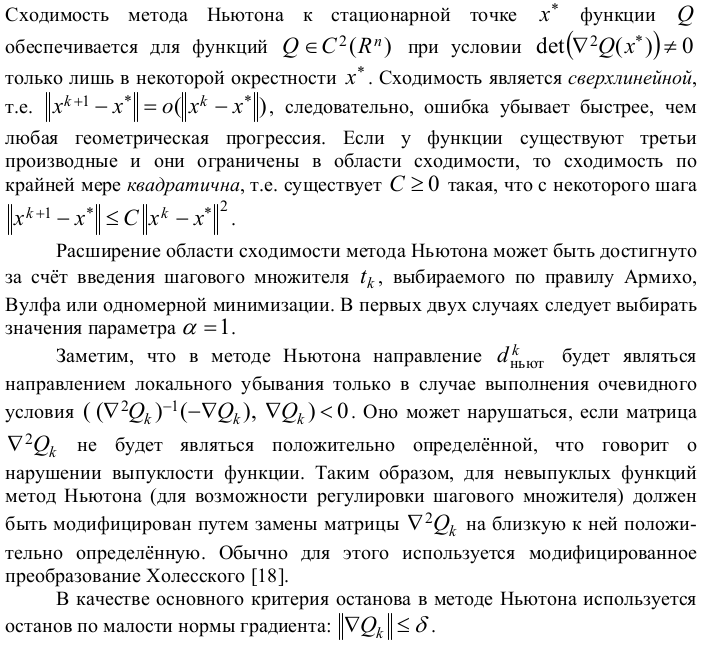

# 21. Метод касательных.

(x-x_{0}),&space;y=f(a)&plus;f'(a)(x-a))
,&space;y&space;-f(b)=f'(b)(x-b))
,&space;y=f(b)&plus;f'(b)(x-b))

Если -f'(c)<0), то 
Если -f'(c)>0),то  

Другое название метода касательных - **метод Ньютона**

