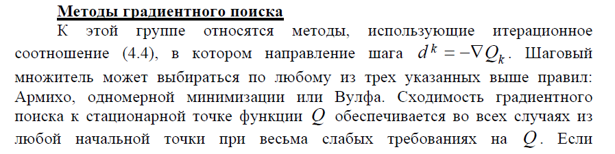
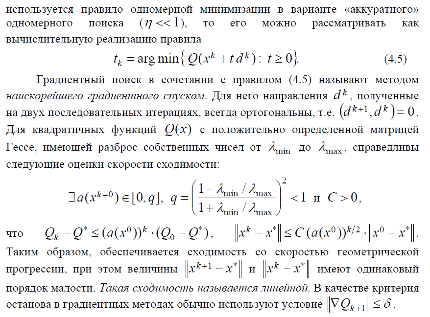

# 23.Методы градиентного поиска.

Рассмотрим задачу :x\in&space;R^{n}\right}>). Большинство методов локальной оптимизации имеют вид итерационных процедур

, _k=0, 1, 2_ **(4.4)**

 - точки с номерами k, k+1

 - направление шага, вектор

 - велечина шага, шаговый множитель

=-\nabla&space;Q_{k}>) - градиентный поиск

 - **метод наискорейшего градиентного поиска**

,&space;t\geq&space;0>)

## Из методички

